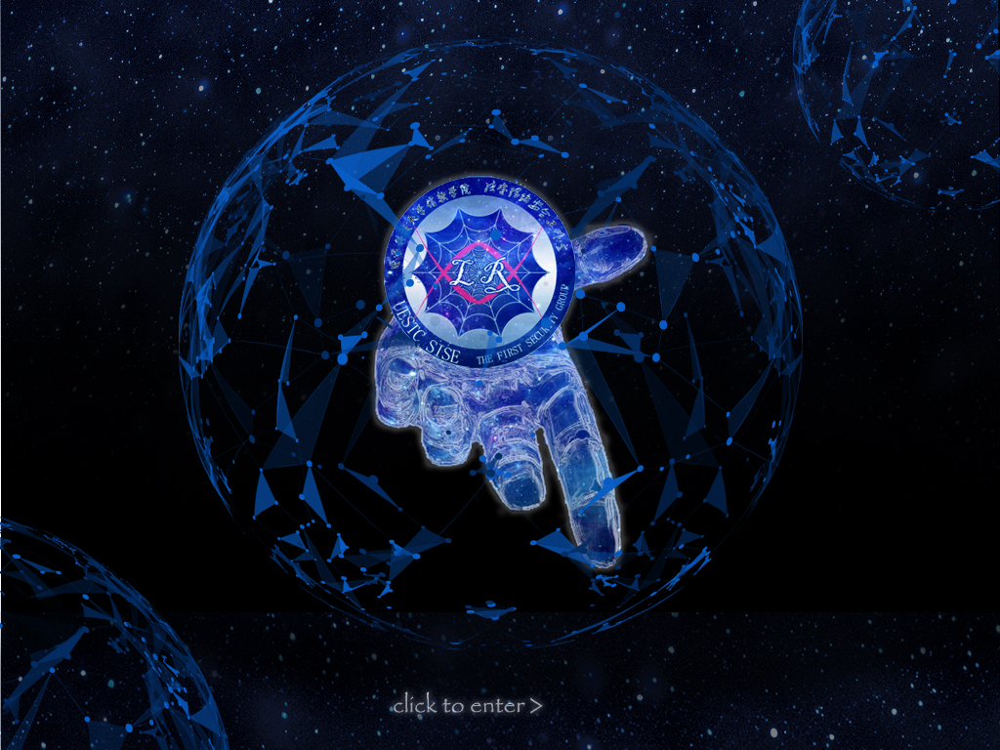
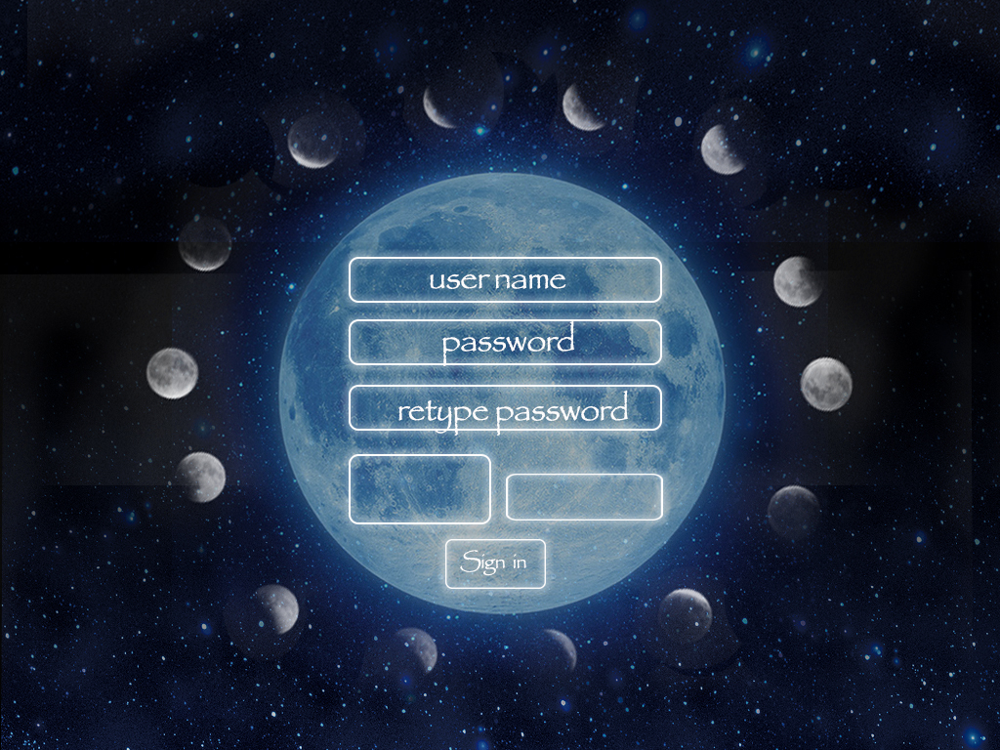
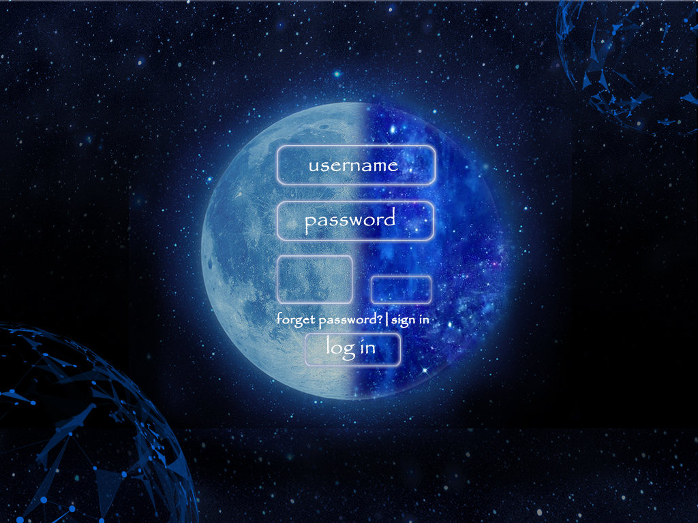

## signPage
---
登录与注册页面

### 一.首页
#### 按钮:
+ click to enter:进入登陆页面
</img>

### 二、注册页面
#### 按钮：
+ username:输入用户名
+ password:输入密码
+ repassword:重复密码
+ sign up:注册
+ 验证码显示框
+ 验证码输入框
</img>

### 二、登录页面  
#### 按钮:
+ username:输入用户名
+ password:输入密码
+ GO!:登录注册页面
+ forget password:找回密码
+ sign up：注册
</img>
