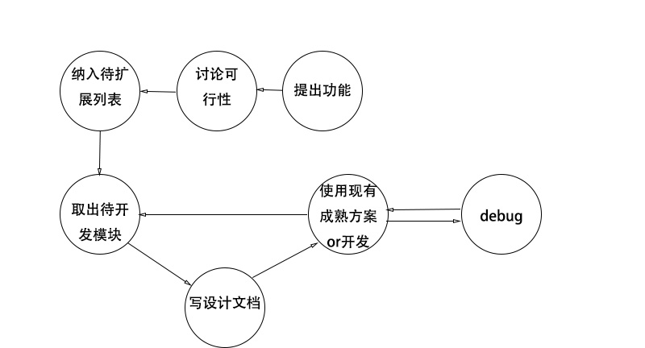

## 开发文档
---
### 一、编写目的  
　 此文档的编写意义在于帮助梳理我们多次更改的需求，文档版本也需要进行同步迭代，有助于将各种需求文档化管理。该文档是开发过程中的事实依据，帮助开发人员对系统架构、性能、功能等进行辅助决策。   

### 二、协作方式  
　 我们使用git进行协作，代码存放在github上

### 三、开发流程
</img>

### 四、项目构造
</img>

### 五、待扩展列表
- [ ] 前端页面重写
- [ ] 自制前端简易框架
- [ ] oj系统
- [ ] 图片上传
- [ ] 题目解析页面
- [ ] 迁移到HTTP/2、https：增强安全性及性能
- [ ] 日志系统：便于debug与其他用途
- [ ] 单元测试、集成测试：有测试才能更方便得修改代码
- [ ] 性能测试方案：拥有相关数据才能优化
- [ ] 抛出错误处理